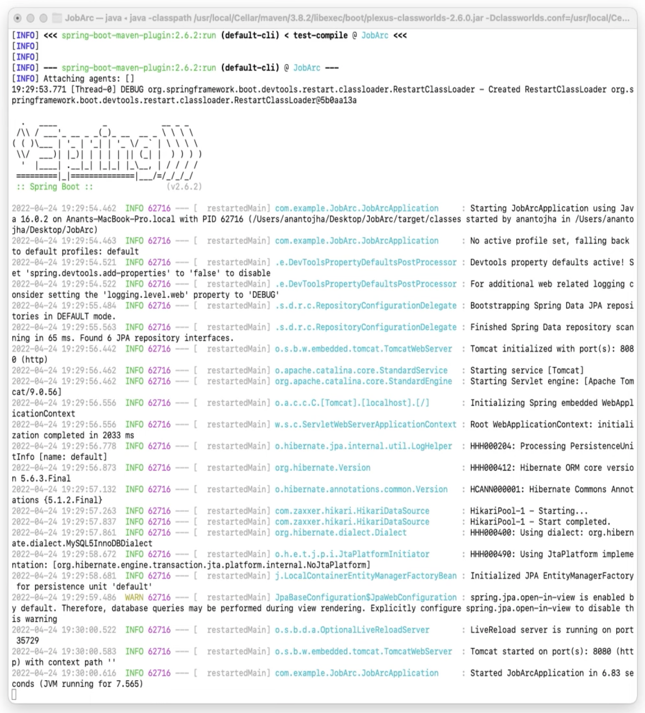
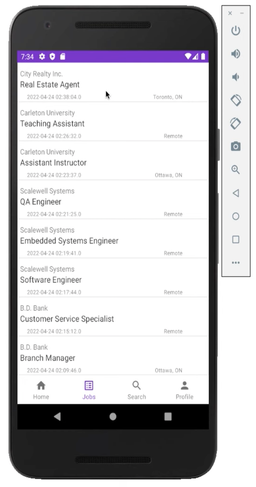
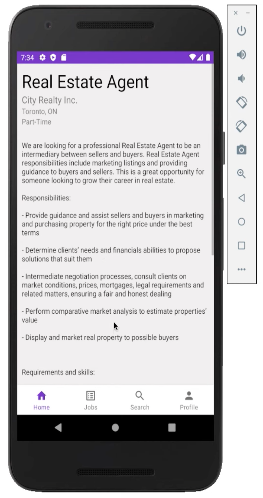
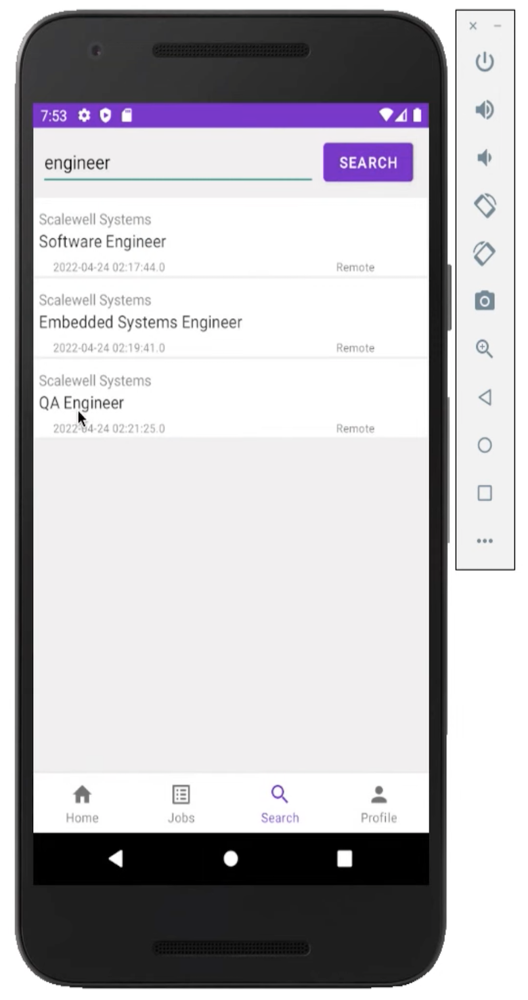
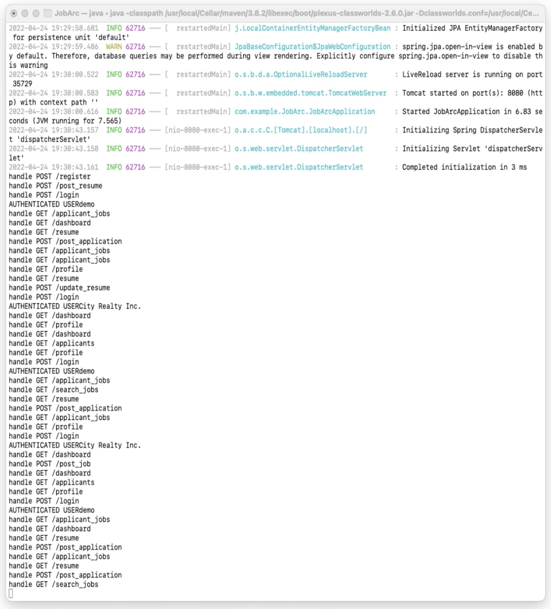

# JobArc System

Demo: https://youtu.be/Q1h6ZhbhtsA
 

  

## SETUP INSTRUCTIONS

Step 1:

	Database setup:

	Create a new Database 

	1. Start MySQL client in command line

		> sudo mysql 
		> create database jobarc;
		> use database jobarc;

	A backup .sql file is provided to add data to db instance (backup of demo db instance)

Step 2: 
	
	Android App setup:

	1. Build and Run Application:

		> Import 'JobArc-Android' into Android Studio IDE
		> Run after build is complete 

Step 3: 	
	
	Spring Web Server setup:

	1. Build and Run Application:

		> Import 'JobArc' into IntelliJ IDEA IDE
		> Run after build is complete 

### Screenshots

